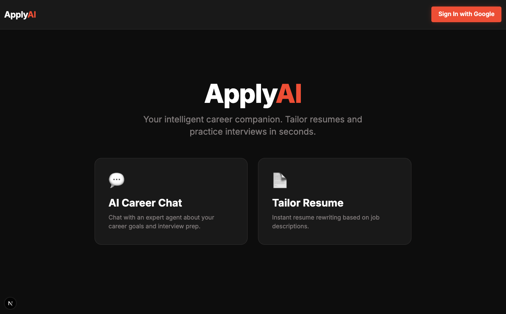
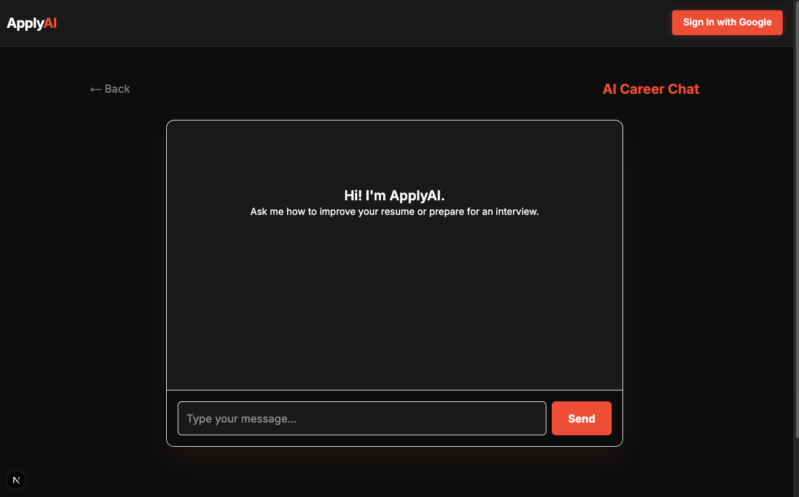
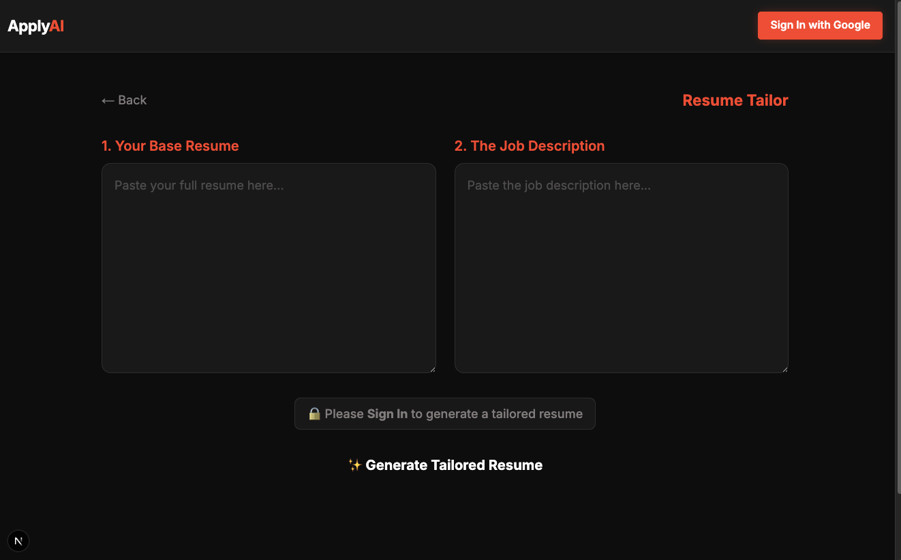
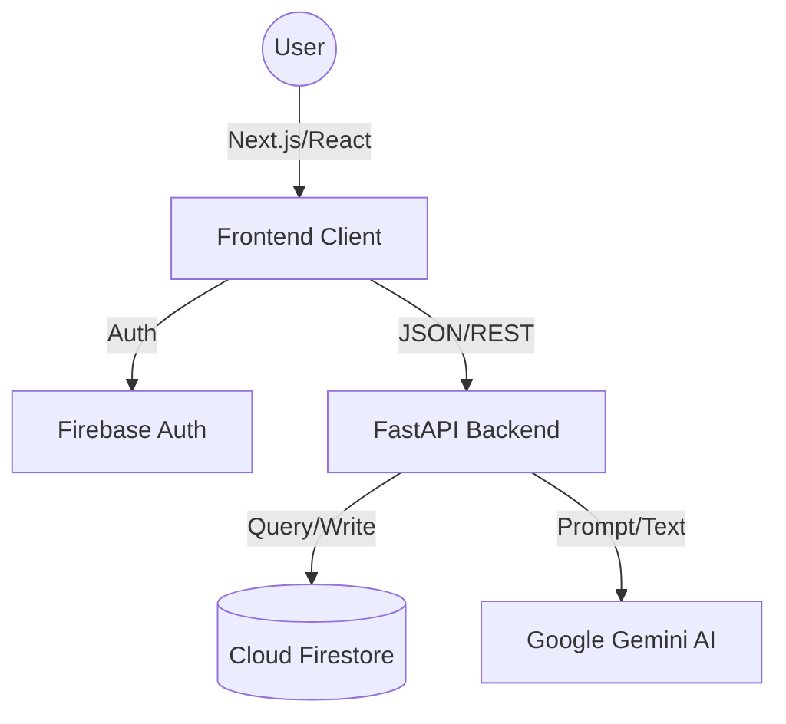

# ApplyAI — AI Job Application Assistant

ApplyAI is a cloud-native, AI-powered assistant that helps streamline the job search. The MVP focuses on shortening application time, increasing application volume, and improving the quality of each submission by providing AI-driven resume tailoring and conversational career guidance.

## 🔗 Live Links
* **Production Web App:** [https://apply-ai-chi.vercel.app](https://apply-ai-chi.vercel.app)
* **API Documentation:** [https://applyai-backend-service-296648600803.us-central1.run.app/docs](https://applyai-backend-service-296648600803.us-central1.run.app/docs)

## Project Gallery

<p align="center">
  
  
  
</p>

## Table of contents

- [Overview & Goals](#overview--goals)
- [Architecture & Tech Stack](#architecture--tech-stack)
- [Core Features](#core-features)
- [Data Model (Firestore)](#data-model-firestore)
- [Getting Started (Local Development)](#getting-started-local-development)
- [Testing Suite](#testing-suite)
- [Roadmap](#roadmap)
- [License](#license)

## Overview & Goals

ApplyAI helps job seekers automate and improve their job applications. The MVP aims to:

- **Reduce application time** by automating tailored materials.
- **Increase application throughput** by making it easy to generate high-quality applications.
- **Maximize job-fit relevance** by emphasizing the most relevant skills in tailored resumes using state-of-the-art LLMs.

## Architecture & Tech Stack

This project is a full-stack, decoupled application following a modern serverless-first architecture.


```mermaid
graph TD;
    User((User)) -->|Next.js/React| FE[Frontend Client];
    FE -->|Auth| FB_Auth[Firebase Auth];
    FE -->|JSON/REST| BE[FastAPI Backend];
    BE -->|Query/Write| FS[(Cloud Firestore)];
    BE -->|Prompt/Text| Gemini[Google Gemini AI];
```

### The Stack

- **Frontend:** **Next.js 15** (Node v24.2)
  - *Rationale:* Leveraging the latest App Router for high-performance React patterns and Tailwind CSS for a modular design system.
- **Backend:** **FastAPI 0.119** (Python 3.13.11)
  - *Rationale:* An asynchronous-first framework providing high-speed execution for AI orchestration and strict data validation via **Pydantic v2**.
- **AI Orchestration:** **Google Gemini 2.5 Flash**
  - *Rationale:* Selected for its industry-leading context window and low-latency response times for complex resume-tailoring tasks.
- **Database & Auth:** **Google Firebase / Cloud Firestore**
  - *Rationale:* Unified identity management and real-time NoSQL document storage for chat history persistence.
- **Infrastructure:** **Docker** + **Google Cloud Run**
  - *Rationale:* Auto-scaling containerized backend that scales to zero when not in use, optimizing for performance and cost.

## Core Features

1.  **Authentication & Security**
    * Secure Google Sign-In with persistent session management.
    * Environment-driven configuration for API keys and Cloud credentials.
2.  **Persistent AI Chat History**
    * `POST /chat` and `GET /chats/{user_id}` endpoints.
    * Career guidance that persists across sessions, allowing users to pick up where they left off.
3.  **Resume Tailoring Engine**
    * `POST /resumes` and `GET /resumes/{user_id}` endpoints.
    * Intelligent rewriting of resumes based on job descriptions, saved to the cloud for future reference.

## Data Model (Firestore)

* **chats** (collection)
  * `doc_id` (auto-generated)
    * `user_id` (string)
    * `messages` (array of `{ role: 'user'|'ai', content: string }`)
    * `timestamp` (serverTimestamp)

* **tailored_resumes** (collection)
  * `doc_id` (auto-generated)
    * `user_id` (string)
    * `jobDescription` (string)
    * `originalResume` (string)
    * `tailoredResume` (string - Markdown)
    * `createdAt` (timestamp)

## Getting Started (Local Development)

### Prerequisites
* Python 3.13.11+ / Node.js 24+
* Google Cloud Service Account with Firestore and Gemini API access.

### 1) Backend (`server/`)
1. `cd server && python3 -m venv .venv && source .venv/bin/activate`
2. `pip install -r requirements.txt`
3. Create `.env` with `GEMINI_API_KEY` and `GOOGLE_APPLICATION_CREDENTIALS`.
4. Run: `uvicorn main:app --reload --port 8000`

### 2) Frontend (`client/`)
1. `cd client && npm install`
2. Create `.env.local` with your Firebase config and `NEXT_PUBLIC_API_URL`.
3. Run: `npm run dev`

## Testing Suite

The backend includes a robust unit testing suite using `Pytest` and `mocker`. To maintain speed and zero-cost CI, all external calls to Gemini and Firestore are fully mocked to prevent network dependency and unnecessary API costs.

**To run tests:**
```bash
cd server
pytest
```

## Deployment Notes

The backend is deployed to **Google Cloud Run**. The frontend is currently local but configured for deployment to Vercel or Firebase Hosting.

* **CORS:** The FastAPI app allows requests from `http://localhost:3000`. For production, update `server/main.py` with the deployed frontend domain.

## Roadmap

- [x] **Phase 1:** Core AI Tailoring Logic & Form UI.
- [x] **Phase 2:** Firebase Authentication & Global Context.
- [x] **Phase 3:** Backend Persistence (Firestore) & Naming Convention Alignment.
- [x] **Phase 4:** Mocked Test Infrastructure & History API Endpoints.
- [x] **Phase 5:** Frontend Hydration (Displaying historical chats/resumes in the UI).
- [x] **Phase 6:** Production Deployment (Cloud Run & Vercel).

## License

See the [LICENSE](LICENSE) file for details.
